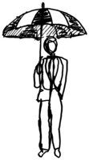
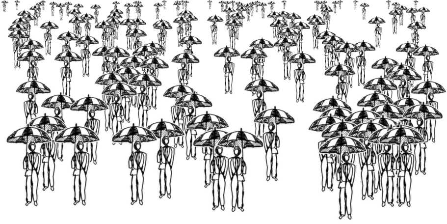

# Algorithmic Character Layout

This software implements a simple algorithm for arranging a collection of
images (“characters”) in a perspective layout that looks uniform.
Randomness and tunable parameters make for varied layouts,
with no repetition of a pattern.

## [Try it out!](https://erikdemaine.org/curved/HangingOut/layout/)

## Example

Here is an example layout produced with the
one built-in image included in the software.

**Input image:** “Umbrella man” drawn by Mariel Bass



**Output layout:** 150 characters in 400×200, max height 40%



Upload your own images and make your own layouts!

## Algorithm

The algorithms implemented by this software are described in detail in our paper
“<b>[Algorithmic Layout of Characters in Perspective](https://erikdemaine.org/papers/Characters_BRIDGES2023/)</b>”
which was presented at [BRIDGES 2023](https://www.bridgesmathart.org/b2023/).

## Sculpture

A version of this software produced the printed patterns in our 14-foot
curved-crease sculpture
“<b>[Hanging Out](https://erikdemaine.org/curved/HangingOut/)</b>” (2023),
which was exhibited at the
[Fitchburg Art Museum](https://fitchburgartmuseum.org/).


## Development

To modify and play with the software, run the following commands
from a Git clone:

```bash
npm install
npm run dev
```

Then open <http://localhost:3000/> in your browser for live development.

Alternatively, you can build a deployable version in `dist`
via the following command:

```bash
npm run build
```
